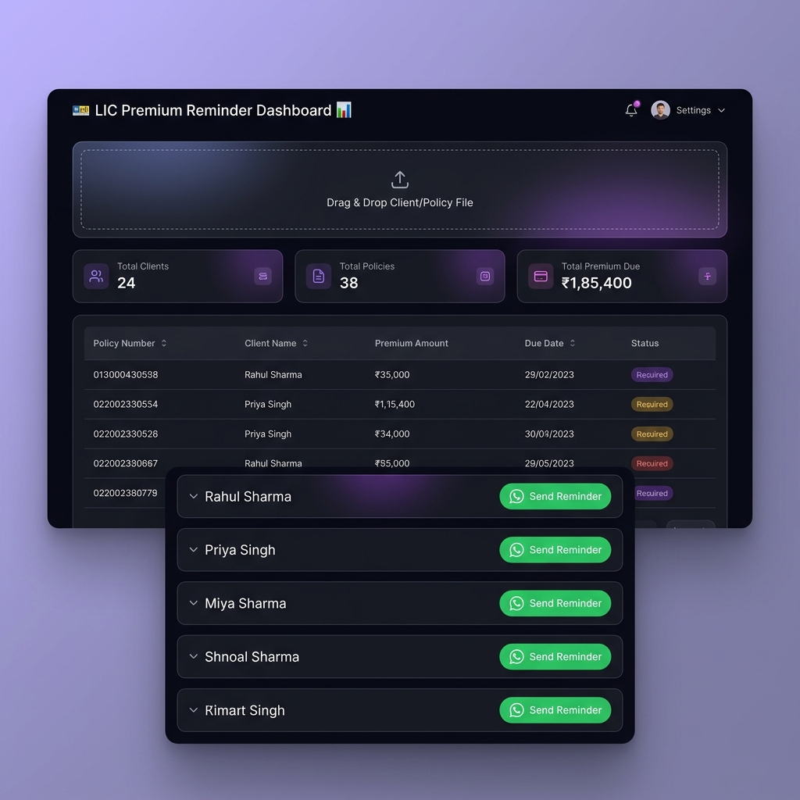
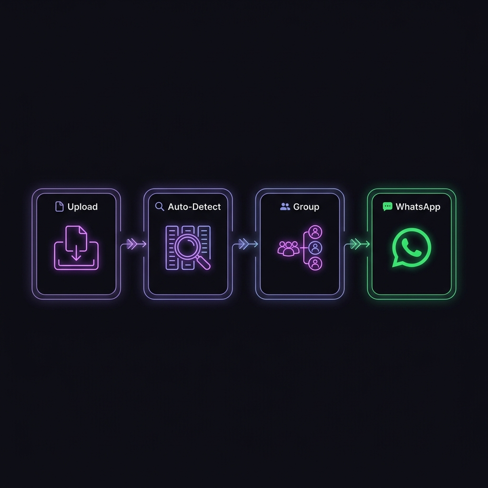
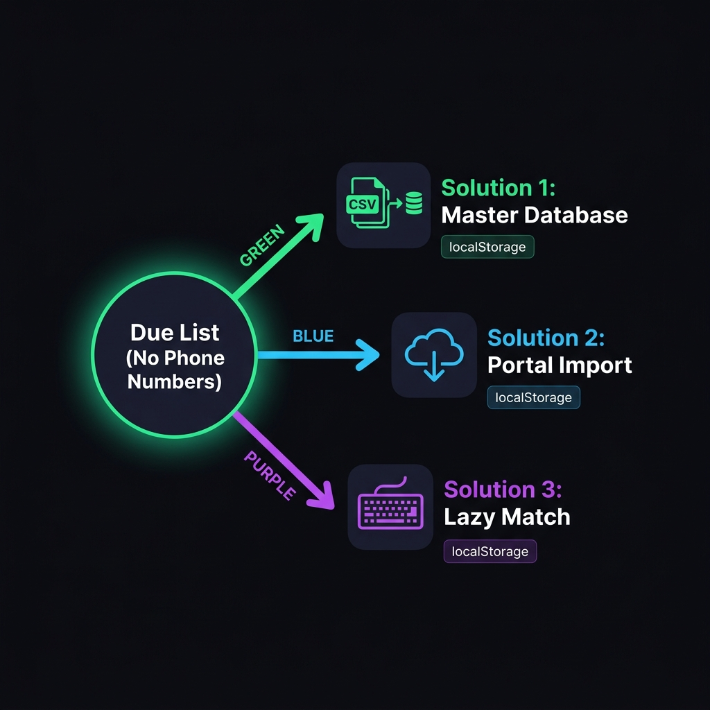

<p align="center">
  
</p>

<h1 align="center">📊 LIC Agent Premium Reminder Dashboard</h1>

<p align="center">
  <strong>Upload your monthly LIC due list → Auto-detect formats → Send WhatsApp reminders in one click</strong>
</p>

<p align="center">
  <a href="https://trambak001.github.io/LIC-Agent-/">🌐 Live Demo</a> &bull;
  <a href="#-features">Features</a> &bull;
  <a href="#-how-it-works">How It Works</a> &bull;
  <a href="#-solution-branches">Solutions</a> &bull;
  <a href="#-quick-start">Quick Start</a>
</p>

<p align="center">
  
  
  
  
</p>

---

## 🎯 The Problem

LIC agents receive a **monthly due list** (PDF/Excel/CSV) containing policy numbers, client names, premium amounts, and due dates — but **no phone numbers**. This means agents have to:

1. Manually look up each client's contact info
2. Type out individual reminder messages  
3. Send them one by one on WhatsApp

For an agent with 50+ policies due each month, this is **hours of tedious work**.

## 💡 The Solution

This dashboard **automates the entire workflow**:

<p align="center">
  
</p>

| Step | What Happens |
|------|-------------|
| **📄 Upload** | Drag & drop your LIC due list (Excel, CSV, or PDF) |
| **🔍 Auto-Detect** | App automatically identifies columns like `PolicyNo`, `Name of Assured`, `FUP`, `TotPrem` |
| **👥 Group** | Clients with multiple policies are grouped together with combined totals |
| **💬 WhatsApp** | One-click WhatsApp message with pre-filled premium reminder |

---

## ✨ Features

- **Multi-Format Support** — Excel (`.xlsx`), CSV, and PDF file parsing
- **Smart Column Detection** — Automatically maps LIC column names (`PolicyNo`, `FUP`, `TotPrem`) to standard fields
- **PDF Table Extraction** — Extracts structured table data from LIC PDF printouts using position-based parsing
- **Client Grouping** — Same client with multiple policies? They're grouped into one card with combined totals
- **WhatsApp Integration** — Pre-formatted messages with one-click send via `wa.me` links
- **Editable Messages** — Preview and customize each message before sending
- **Copy to Clipboard** — Quick copy for clients without phone numbers
- **100% Client-Side** — No data leaves your browser. No servers. Complete privacy.
- **Dark Premium UI** — Modern dark theme with smooth animations and glassmorphism effects
- **Mobile Responsive** — Works on phones, tablets, and desktops

---

## 🔧 How It Works

### File Parsing Engine

```
┌─────────────┐     ┌──────────────┐     ┌─────────────┐
│   Excel     │     │     CSV      │     │    PDF      │
│  (.xlsx)    │     │   (.csv)     │     │   (.pdf)    │
└──────┬──────┘     └──────┬───────┘     └──────┬──────┘
       │                   │                     │
       ▼                   ▼                     ▼
   SheetJS             Built-in              pdf.js +
   Library             Parser             Position-based
                                          Table Extractor
       │                   │                     │
       └───────────────────┼─────────────────────┘
                           ▼
                  ┌────────────────┐
                  │  Auto Column   │
                  │   Detection    │
                  │  (alias map)   │
                  └───────┬────────┘
                          ▼
                  ┌────────────────┐
                  │ Client Grouping│
                  │  + Messaging   │
                  └───────┬────────┘
                          ▼
                  ┌────────────────┐
                  │   Dashboard    │
                  │  + WhatsApp    │
                  └────────────────┘
```

### Column Alias Map

The app recognizes these LIC column variations automatically:

| Standard Column | Recognized Aliases |
|----------------|--------------------|
| **Client Name** | `Name of Assured`, `Client Name`, `Name`, `Assured Name` |
| **Policy Number** | `PolicyNo`, `Policy Number`, `Policy No`, `Policy_Number` |
| **Premium Amount** | `TotPrem`, `Total Premium`, `Premium Amount`, `InstPrem` |
| **Due Date** | `FUP`, `Due Date`, `Due_Date`, `Premium Due Date` |
| **Phone Number** | `Phone Number`, `Phone`, `Mobile`, `Contact`, `Mobile Number` |

---

## 🌿 Solution Branches

The core problem: **LIC due lists don't include phone numbers**. We provide **3 different solutions**, each on its own Git branch:

<p align="center">
  
</p>

### Branch: `master` — Base App
The foundation. Upload, parse, group, and generate messages. If your file includes phone numbers, WhatsApp buttons work automatically.

---

### Branch: `solution-1-master-database`
> **Best for:** Agents who can export a complete client roster once

**How it works:**
1. Upload your full client roster (CSV/Excel with Policy Number + Phone Number) **once**
2. The app saves it in your browser's `localStorage`
3. Every month, just upload the due list — phone numbers are auto-merged

**Extra files:** [`solution1.js`](solution1.js)

```
Due List (no phones) + Master Database (has phones)
        │                        │
        └──── pd.merge() ───────┘
                   │
                   ▼
          Due List WITH Phones ✅
```

---

### Branch: `solution-2-web-scraper`
> **Best for:** Agents whose contacts are only in the LIC portal

**How it works:**
1. Log into the LIC agent portal and export your client data
2. Upload that export file here
3. Phone numbers are cached in `localStorage` and auto-matched

**Extra files:** [`solution2.js`](solution2.js)

---

### Branch: `solution-3-lazy-match`
> **Best for:** Agents who want zero setup — just start using it

**How it works:**
1. Upload your due list as usual
2. Type the phone number next to each client **once**
3. Click "💾 Save All Phone Numbers"
4. Next month, those numbers **auto-fill** — no retyping!

**Extra files:** [`solution3.js`](solution3.js)

```
Month 1: Upload → Type numbers → Save → Send ✅
Month 2: Upload → Numbers auto-fill! → Send ✅
Month 3: Upload → Numbers auto-fill! → Send ✅
```

---

## 🚀 Quick Start

### Option 1: Use the Live Site
Just visit: **[https://trambak001.github.io/LIC-Agent-/](https://trambak001.github.io/LIC-Agent-/)**

### Option 2: Run Locally
```bash
# Clone the repo
git clone https://github.com/trambak001/LIC-Agent-.git
cd LIC-Agent-

# Switch to the solution you want
git checkout master                      # Base app
git checkout solution-1-master-database  # VLOOKUP merge
git checkout solution-2-web-scraper      # Portal import
git checkout solution-3-lazy-match       # Manual entry + memory

# Open in browser
start index.html   # Windows
open index.html    # macOS
```

No build step. No dependencies. No server. Just open `index.html`.

---

## 📁 Project Structure

```
LIC-Agent-/
├── index.html          # Main page
├── style.css           # Dark theme styling
├── app.js              # Core logic (parsing, grouping, messaging)
├── solution1.js        # [Branch: solution-1] Master DB merge
├── solution2.js        # [Branch: solution-2] Portal import
├── solution3.js        # [Branch: solution-3] Lazy match
├── assets/
│   ├── banner.png      # Dashboard preview
│   ├── solutions.png   # Solution architecture
│   └── workflow.png    # Workflow diagram
├── .gitignore
└── README.md
```

---

## 🔒 Privacy & Security

| Aspect | Detail |
|--------|--------|
| **Data Storage** | All data stays in your browser (`localStorage`) |
| **Server Calls** | Zero. No backend. No API calls. No analytics. |
| **File Processing** | 100% client-side using JavaScript |
| **Phone Numbers** | Saved only in YOUR browser's local storage |
| **Source Code** | Fully open source — inspect every line |

> **Your client data never leaves your device.** Not even we can see it.

---

## 🛠️ Tech Stack

| Technology | Purpose |
|-----------|---------|
| **HTML5** | Page structure |
| **CSS3** | Dark theme with custom properties, animations, glassmorphism |
| **Vanilla JavaScript** | All application logic |
| **[SheetJS](https://sheetjs.com/)** | Excel file parsing (loaded via CDN) |
| **[PDF.js](https://mozilla.github.io/pdf.js/)** | PDF text extraction (loaded via CDN) |
| **GitHub Pages** | Free static hosting |

---

## 🤝 Contributing

1. Fork the repo
2. Create a feature branch (`git checkout -b feature/amazing-feature`)
3. Commit your changes (`git commit -m 'Add amazing feature'`)
4. Push to the branch (`git push origin feature/amazing-feature`)
5. Open a Pull Request

---

## 📄 License

This project is open source and available under the [MIT License](LICENSE).

---

<p align="center">
  Built with ❤️ for LIC Agents across India
</p>
